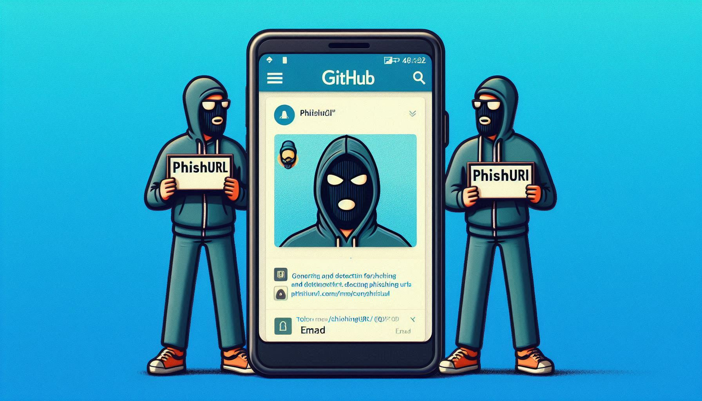

# PhishiUrl - Phishing Detection and Simulation Tool

PhishiUrl is a powerful tool for detecting and simulating phishing attacks, designed to assist cybersecurity professionals and penetration testers in identifying and mitigating vulnerabilities. With a variety of features, including homoglyph URL generation, website cloning, and URL security analysis, this tool is built for ethical security testing.

A related article: [PDF](homograph_full.pdf "PhishiUrl")

**Current Version**: 1.3.0  
**Author**: Emad  
**GitHub Repository**: github.com/EmadYaY/PhishiUrl

## ⚠️ Legal Warning

Using this tool for illegal purposes, such as stealing data or conducting real phishing attacks, is strictly prohibited. PhishiUrl is intended solely for legal penetration testing with explicit permission from the website owner. Any unauthorized use is the user's responsibility.

## ✨ Features

### Advanced Phishing Detection
- Identifies Unicode homoglyph characters in URLs (Cyrillic, Greek, etc.)
- Detects ASCII character substitutions used for brand impersonation (e.g., `faceb00k` → `facebook`, `paypa1` → `paypal`)
- Detects suspicious keywords (e.g., login, verify, secure)
- Integrates with VirusTotal and PhishTank APIs for URL security analysis

### Phishing URL Generation
- Suggests homoglyph domains by replacing characters with Unicode lookalikes (e.g., `o` with `о`)
- Checks domain availability using WHOIS

### Website Cloning
- Clones web pages by downloading resources (HTML, CSS, JS, images)
- `--download-js` option to download JavaScript files
- `--download-all` option to download all assets (images, fonts, etc.)
- Preserves SPA asset directory structure (e.g., `/assets/`)
- Captures user input data (e.g., username, password) upon form submission
- Automatically redirects to the original domain after capturing data

### Iframe Mode
- Displays the original site in an iframe while capturing user data silently
- `--use-iframe` option to enable iframe mode instead of cloning
- Keylogging support via `/keylog` endpoint

### Tunneling with Ngrok
- Creates a tunnel with Ngrok for remote access to the fake page
- Generates a QR code for quick access to the tunnel URL

### Hosts File Management
- Modifies the system hosts file to map homoglyph domains locally
- Works on Windows (requires Administrator), Linux and macOS (requires sudo)

### Reporting
- Generates detailed reports for URL analysis and captured data in `report.json` and `credentials.txt`
- Optional keylogging data saved in `keylog.txt` (in iframe mode)

## 🛠️ Prerequisites

- Python 3.7 or higher
- Google Chrome (for Selenium-based DOM enrichment)
- Dependencies:
  ```
  pip install click rich requests pyngrok python-whois qrcode beautifulsoup4 lxml selenium webdriver-manager
  ```
- On Windows only: `pip install pywin32`
- Ngrok Token: For tunneling (add to config.json)
- VirusTotal API Key: For URL analysis (optional, add to config.json)
- PhishTank API Key: For PhishTank lookups (free at phishtank.org, add to config.json)

## 📦 Installation

1. Clone the repository:
   ```bash
   git clone https://github.com/EmadYaY/PhishiUrl.git
   cd PhishiUrl
   ```

2. Create and activate a virtual environment:
   ```bash
   python -m venv venv
   source venv/bin/activate        # Linux/Mac
   venv\Scripts\activate           # Windows CMD
   .\venv\Scripts\Activate.ps1     # Windows PowerShell
   ```

   > **PowerShell error?** Run: `Set-ExecutionPolicy -ExecutionPolicy RemoteSigned -Scope CurrentUser`

3. Install the dependencies:
   ```bash
   pip install .
   ```

   > **Bash/Zsh error?** Run: `ip install . --break-system-packages --force-reinstall --no-cache-dir --ignore-installed PyYAML`
      If you dont wana use venv: --break-system-packages


4. Configure `config.json`:
   ```json
   {
       "ngrok_token": "YOUR_NGROK_TOKEN",
       "virustotal_api_key": "YOUR_VIRUSTOTAL_API_KEY",
       "phishtank_api_key": "YOUR_PHISHTANK_API_KEY",
       "templates_path": "./templates"
   }
   ```

   > **VirusTotal API key**: Sign up at [virustotal.com](https://virustotal.com) → Profile → API key (free tier available)  
   > **PhishTank API key**: Register at [phishtank.org](https://phishtank.org) (free)

## 🚀 Commands and Usage

### 1. Check URLs for Phishing
Detect suspicious URLs using homoglyphs, brand impersonation, keywords, and external APIs.
```bash
phishiurl check --url faceb00k.com
```

With a file (one URL per line, UTF-8 encoded):
```bash
phishiurl check --file urls.txt --output results.json
```

### 2. Start a Tunnel and Web Server
Tunnel a phishing page with Ngrok and start a local server.
```bash
phishiurl tunnel --port 8080 --template instagram_login.html --use-ngrok
```

### 3. Suggest Homoglyph Domains
Generate similar domains using homoglyph characters.
```bash
phishiurl suggest --domain google.com --check-availability
```

### 4. Check URLs with External APIs
Analyze a URL using VirusTotal or PhishTank.
```bash
phishiurl api_check --url faceb00k.com --service virustotal
phishiurl api_check --url faceb00k.com --service phishtank
```

### 5. Clone a Website or Use Iframe
Clone a website, use local files, or display in an iframe, capture user data, and serve it locally or remotely.

Clone with all assets:
```bash
phishiurl clone --url https://domain.tld/login --port 8080 --use-ngrok --download-js --download-all
```

Use iframe mode:
```bash
phishiurl clone --url https://domain.tld/login --port 8080 --use-ngrok --use-iframe
```

Clone from local files:
```bash
phishiurl clone --local-folder ./my_website --port 8080
```

### 6. Show Help
```bash
phishiurl help
```

## 🧪 Testing the Tool

### Test Phishing Detection

```bash
phishiurl check --url "faceb00k.com/login"
# Expected: PHISHING (score ≥ 70) — brand impersonation detected

phishiurl check --url "google.com"
# Expected: SAFE (score = 0)
```

With a file (create with UTF-8 encoding):
```powershell
# Windows PowerShell
"faceb00k.com`ngoogle.com`npaypa1.com/verify" | Out-File -Encoding utf8 urls.txt
phishiurl check --file urls.txt --output results.json
```

### Test Website Cloning

1. Open a terminal with Administrator privileges (Windows) or use `sudo` (Linux/Mac)

2. Run the clone command:
   ```bash
   phishiurl clone --url https://domain.tld/login/ --port 8080 --download-js --download-all
   ```

3. Open browser at `http://localhost:8080`

4. Submit the form — credentials should be saved in:
   ```
   templates/cloned/domain_tld/credentials.txt
   ```

### Test Iframe Mode

```bash
phishiurl clone --url https://domain.tld/login/ --port 8080 --use-iframe
```

- The page displays the original site in an iframe
- Keystrokes are captured in `keylog.txt`

### Test Homoglyph Generation

```bash
phishiurl suggest --domain google.com --check-availability
```

Expected output includes domains like `gооgle.com` (Cyrillic о) with WHOIS availability status.

## 🔍 Detection Engine

PhishiUrl v1.3.0 uses a multi-layer detection system:

| Layer | Example | Score |
|-------|---------|-------|
| Unicode homoglyphs (Cyrillic/Greek) | `facebооk.com` | +60 |
| Brand impersonation (0→o, 1→l + brand match) | `faceb00k` → `facebook` | +70 |
| Suspicious substitution (no brand match) | `g0t0.com` | +30 |
| Suspicious keyword in URL | `/verify`, `/login` | +15 each |
| Unusually long URL | >75 characters | +10 |
| VirusTotal flagged malicious | — | +50 |
| PhishTank flagged malicious | — | +50 |

URLs with score ≥ 60 are classified as **PHISHING**.

## 🎯 Future Goals and Improvements


### Planned Improvements

#### Optimize Website Cloning
- Integrate with [goclone](https://github.com/goclone-dev/goclone) for faster and more accurate website cloning
- Fix issues with loading dynamic resources (e.g., external APIs)

#### Enhance Security Detection
- Add detection for security headers (e.g., `X-Frame-Options`) to flag protected sites
- Integrate with tools like [Spoofy](https://github.com/MattKeeley/Spoofy) for DNS/email vulnerability analysis

#### Advanced Reporting
- Visual reports using Matplotlib
- Statistical analysis (e.g., number of successful phishing attempts)

### New Features

#### Iframe Mode Enhancements
- Customizable iframe appearance (fake headers, favicon)

#### Advanced Keylogger
- Real-time keylogging with enable/disable toggle

#### OSINT Integration
- Integrate with [Telepathy](https://github.com/EmadYaY/Telepathy) for Telegram-based phishing analysis

#### Reverse Proxy Support
- Nginx-based reverse proxy to bypass iframe restrictions

### Integration with Other Tools
- [DLP Toolbox](https://dlptoolbox.com): Test Data Loss Prevention policies alongside phishing simulations
- [Email Spoof Test](https://emailspooftest.com): Test email security and simulate email phishing attacks

## 🤝 Contributing

We welcome contributions! To report bugs, suggest features, or submit a pull request:

1. Fork the repository: github.com/EmadYaY/PhishiUrl
2. Make your changes and submit a pull request
3. Use GitHub Issues for bug reports and feature requests

## 📜 Version History

### Version 1.3.0 (March 2026)
- **Cross-platform support**: Now works on Linux and macOS (not Windows-only)
- **Improved detection engine**: Brand impersonation detection (`faceb00k` → `facebook`, `paypa1` → `paypal`, etc.)
- **Fixed**: `check --file` Unicode/encoding error (UTF-16 BOM from PowerShell)
- **Fixed**: SPA asset path structure preserved during cloning (`/assets/` subdirectory)
- **Fixed**: VirusTotal API upgraded to v3, with submit-then-poll flow for free tier
- **Fixed**: PhishTank now requires API key — clear error message provided
- **Fixed**: `suggest` command no longer produces duplicate rows
- **Fixed**: `BeautifulSoup new_tag()` name conflict crash
- **Added**: `--use-iframe` flag on `clone` command
- **Added**: `/keylog` endpoint for iframe keylogging
- **Added**: Automatic ChromeDriver management via `webdriver-manager`
- **Improved**: Server output with Rich panels and cleaner logging

### Version 1.2.8 (April 2025)
- Added `--download-all` option to download all assets
- Added iframe mode with `--use-iframe` option
- Data capture only on form submission
- Improved handling of downloaded resource paths

### Version 1.2.7
- Added initial cloning functionality and Ngrok integration

## 📄 License

This project is licensed under the MIT License. See the [LICENSE](LICENSE) file for details.
